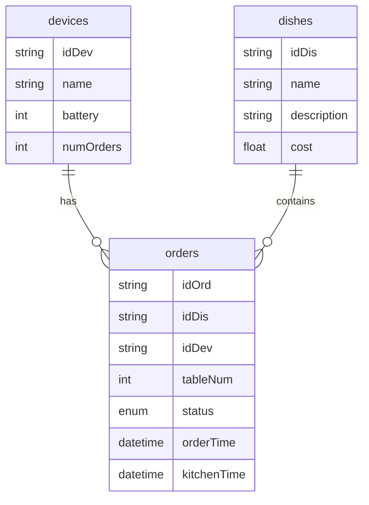

# OrderCast - Waiter Order System

**OrderCast** is a system that allows waiters to take orders with ESP-powered devices. The system uses a Raspberry Pi with three running Docker containers: API, DB, and Frontend. The orders are displayed on a touchscreen, and real-time updates are handled through these containers.

## Architecture Overview

### Docker Containers:
1. **API**: Handles communication with devices for adding, updating, and removing orders.
2. **DB**: Stores three tables: `orders`, `dishes`, and `devices`.
3. **Frontend**: An Apache server that directly manages the DB.

### Database Schema



### Endpoints

The API exposes three endpoints:

1. **Update Device** (`POST /update`): 
    - **Request**: `{ idDev, name, battery }`
    - **Response**: Updated list of "dishes" and all orders that are not "done" or "deleted" (that have idDev equal to the idDev sent) along with the last `idOrd`. This also updates the device's battery and number of orders.

2. **Add Order** (`POST /add`):
    - **Request**: `{ idOrd, idDis, idDev, tableNum }`
    - **Response**: Confirmation of order creation.

3. **Remove Order** (`POST /remove`):
    - **Request**: `{ idOrd, idDis }`
    - **Response**: Marks the specified order as "deleted".

## System Components

### 1. Database (DB)
The database contains three tables:

- **devices**:
    - `idDev`: Device ID
    - `name`: Device name (e.g., waiter name)
    - `battery`: Device battery status
    - `numOrders`: Number of orders the device has processed

- **orders**:
    - `idOrd`: Order ID
    - `idDis`: Dish ID (linked to dishes table)
    - `idDev`: Device ID (linked to devices table)
    - `tableNum`: Table number for the order
    - `status`: Order status (waiting, working, done, deleted)
    - `orderTime`: Time the order was placed
    - `kitchenTime`: Time the order was processed in the kitchen

- **dishes**:
    - `idDis`: Dish ID
    - `name`: Dish name
    - `description`: Dish description
    - `cost`: Dish cost

### 2. API (API)
The API container communicates with ESP devices and the Frontend via three endpoints:

#### `POST /update`
The device sends `idDev`, `name`, and `battery` information. In response, it gets:
- An updated list of dishes
- All orders that are not marked as "done" or "deleted"
- The last `idOrd` used

Example Request:
```json
{
  "idDev": "1",
  "name": "Waiter 1",
  "battery": 75
}
```

Example Response:
```json
{
  "dishes": [
    { "idDis": "1", "name": "Pasta", "description": "Tomato pasta", "cost": 12.5 },
    { "idDis": "2", "name": "Salad", "description": "Fresh green salad", "cost": 8.0 }
  ],
  "orders": [
    { "idOrd": "101", "idDis": "1", "idDev": "1", "tableNum": 5, "status": "waiting", "orderTime": "2025-02-10T10:00:00Z" },
    { "idOrd": "102", "idDis": "2", "idDev": "1", "tableNum": 3, "status": "working", "orderTime": "2025-02-10T10:05:00Z" }
  ],
  "lastOrderId": "102"
}
```

#### `POST /add`
Creates a new order with the given `idOrd`, `idDis`, `idDev`, and `tableNum`.

Example Request:
```json
{
  "idOrd": "103",
  "idDis": "1",
  "idDev": "2",
  "tableNum": 7
}
```

Example Response:
```json
{
  "status": "Order created successfully"
}
```

#### `POST /remove`
Marks the specified order as "deleted" given `idOrd` and `idDis`.

Example Request:
```json
{
  "idOrd": "101",
  "idDis": "1"
}
```

Example Response:
```json
{
  "status": "Order marked as deleted"
}
```

### 3. Frontend (Frontend)
The Frontend is an Apache server running on the Raspberry Pi, allowing managers to directly access and manage the database without passing through the API. The interface is built for ease of use and direct manipulation of orders.

## Devices

>[!WARNING] 
Work in progress

## License
This project is licensed under the MIT License - see the [LICENSE](LICENSE) file for details.